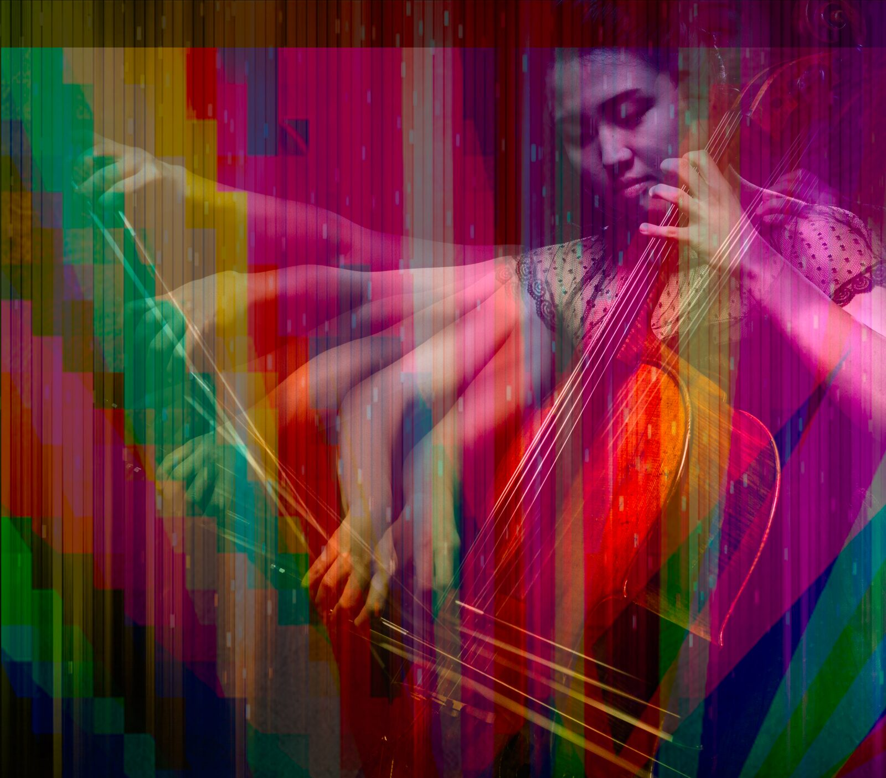

# Fernando Voltolini de Azambuja

Color scientist and imaging engineer working across camera image quality,
HDR/SDR, color measurement, visual perception, and research software. My
background in advertising photography and digital capture connects hands-on
camera practice with quantitative imaging work.

## [Explore my imaging engineering and color science portfolio →](https://ferazambuja.github.io/)

Camera image-quality studies, color and spectral measurement, HDR research
software, interactive tools, and selected C++20 implementations.

  
   
  <em>Original photograph and digital composite by Fernando</em>

[Imaging and color measurement](https://ferazambuja.github.io/imaging/) ·
[HDR psychophysics platform](https://ferazambuja.github.io/hdr-platform/) ·
[CAM16/Hellwig–Fairchild calculator](https://ferazambuja.github.io/imaging/cam16-hellwig-comparator/) ·
[LinkedIn](https://www.linkedin.com/in/fernando-voltolini-de-azambuja)
