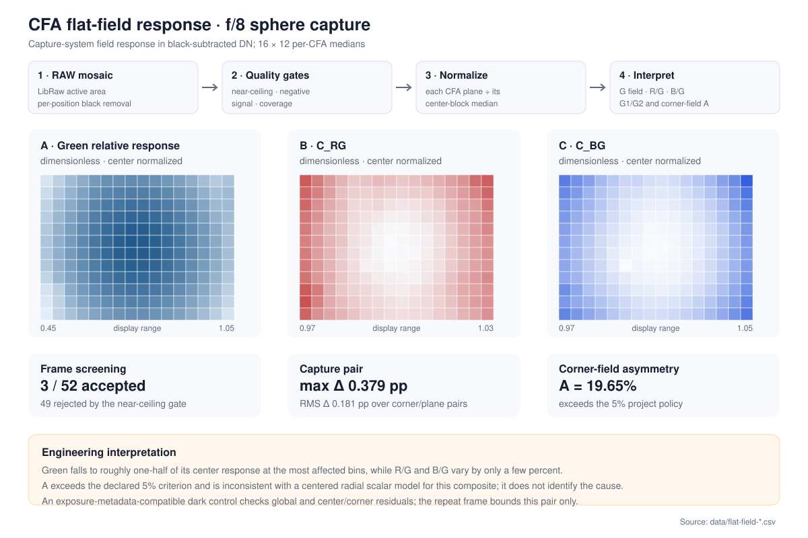
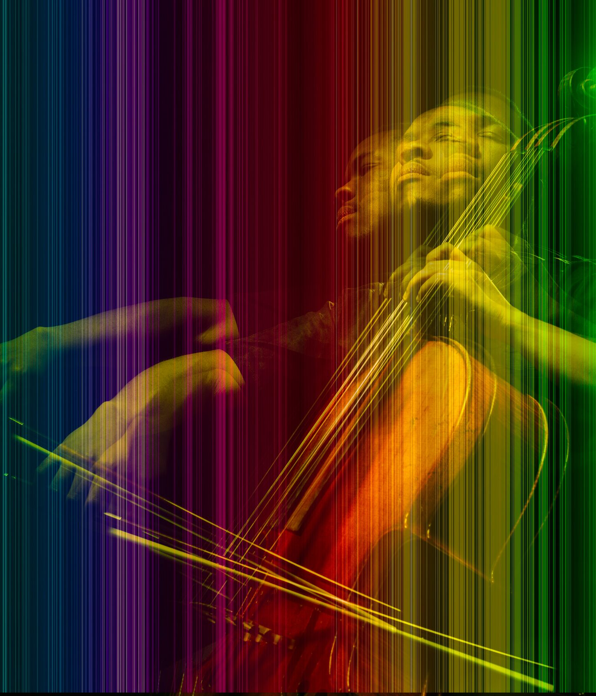
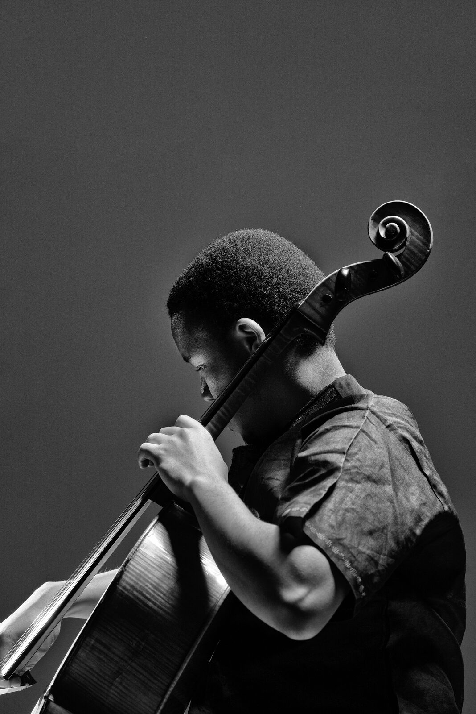

# Imaging Engineering & Color Science

I build C++20, Python, and Swift/Metal tools for camera image quality, color
science, and HDR/SDR research. My work combines sensor-level analysis,
numerical methods, and hands-on color measurement with professional studio
experience as a Photographic Assistant and Digital Capture Technician.

  
   
  <em>Original photograph and digital composite by Fernando</em>

[LinkedIn](https://www.linkedin.com/in/fernando-voltolini-de-azambuja)

## Selected work

<table>
  <tr>
    <td width="50%" valign="top">
       
      <strong><a href="https://ferazambuja.github.io/imaging/studies/sfr-aperture-and-field/">Sharpness across aperture and frame</a></strong> 
      Measured 299 slanted-edge regions and found that a single center value did not describe both capture systems.
    </td>
    <td width="50%" valign="top">
       
      <strong><a href="https://ferazambuja.github.io/imaging/studies/gamut-mapping/">Mapping wide-gamut color into sRGB</a></strong> 
      Compared coordinate and algorithm choices while retaining a case where improving one severe error raised the grid average.
    </td>
  </tr>
  <tr>
    <td width="50%" valign="top">
       
      <strong><a href="https://ferazambuja.github.io/imaging/studies/spectral-sensitivity-and-color-fidelity/">Can spectral sensitivity predict camera color?</a></strong> 
      Tested measured sensitivities against chart captures, separating physical closure from theoretical fit quality.
    </td>
    <td width="50%" valign="top">
       
      <strong><a href="https://ferazambuja.github.io/imaging/studies/cfa-flat-field-response/">What a uniform-field capture revealed</a></strong> 
      Screened 52 sphere captures and showed that the accepted composite field could not be explained by a centered radial correction alone.
    </td>
  </tr>
</table>

## Engineering work in depth

### Camera image quality and C++

Built a public
[camera image-quality and color-science portfolio](https://ferazambuja.github.io/imaging/)
that combines readable scientific studies, aggregate results, and selected
tested C++20 numerical cores. Across eight investigations, the work connects
capture decisions, physical measurements, and color-science algorithms:

- [Camera response](https://ferazambuja.github.io/imaging/studies/sfr-aperture-and-field/):
  measured 299 slanted-edge regions across Nikon D800/D810 aperture series,
  then screened 52 integrating-sphere captures and analyzed the three with
  usable headroom for spatial and chromatic field behavior.
- [Color characterization](https://ferazambuja.github.io/imaging/studies/colorchecker-ccm/):
  evaluated a linear color-correction matrix on patches withheld from fitting,
  then showed why a favorable lighter-patch result did not improve the complete
  chart.
- [Spectral and instrument analysis](https://ferazambuja.github.io/imaging/studies/spectral-sensitivity-and-color-fidelity/):
  tested four paired camera-sensitivity paths against chart captures and
  compared repeated spectroradiometer records separately for level, spectral
  shape, and chromaticity.
- [Color-management algorithms](https://ferazambuja.github.io/imaging/studies/gamut-mapping/):
  implemented Display-P3-to-sRGB mapping with analytic boundary searches and
  Local MINDE, reducing mean/maximum CIEDE2000 from 2.947/9.956 to 2.323/7.602
  under the controlled comparison.
- [Color-appearance models](https://ferazambuja.github.io/imaging/cam16-hellwig-comparator/):
  built a dependency-free browser calculator and
  [Python/JavaScript utility](https://github.com/ferazambuja/cam16-hellwig-comparator)
  that compare CAM16 with the Hellwig–Fairchild 2022 formulation under the
  same declared viewing conditions, with CSV/JSON output and automated
  cross-checks against Colour 0.4.7.

Where historical controls were incomplete, the camera and instrument studies
keep the conclusion at the level the measurements support. The deterministic
studies state their modeled conditions directly.

[Portfolio website](https://ferazambuja.github.io/imaging/) ·
[Technical repository](https://github.com/ferazambuja/imaging-color-measurement) ·
[Study index](https://ferazambuja.github.io/imaging/studies/)

  
   
  <em>Original photograph and digital composite by Fernando</em>

### HDR/SDR psychophysics research platform

Built an end-to-end Swift/Metal macOS research application for study authoring,
controlled execution, response and session records, HDR presentation state,
measurement context, psychometric analysis, and structured export as part of
my M.S. thesis under Dr. Mark D. Fairchild.

## Published imaging research

Both are coauthored team publications, listed in their published author order.

- [Sensitivity analysis applied to ISO recommended camera color calibration
  methods to determine how much of an advantage, if any, does spectral
  characterization of the camera offer over the chart-based
  approach](https://doi.org/10.2352/ISSN.2470-1173.2017.15.DPMI-072) —
  2017(15), 32–36. Keith Borrino; **Fernando Voltolini de Azambuja**; Nitin
  Sampat; J. A. Stephen Viggiano.
  I performed the monochromator-plus-camera and camSPECS spectral-responsivity
  captures and contributed to the team's coding and data analysis.
- [Assessing the Ability of Simulated Laboratory Scenes to Predict the Image
  Quality Performance of HDR Captures (and Rendering) of Exterior Scenes Using
  Mobile Phone Cameras](https://doi.org/10.2352/ISSN.2470-1173.2017.12.IQSP-251)
  — 2017(12), 100–104. Amelia Spooner; Ashley Solter; **Fernando Voltolini de
  Azambuja**; Nitin Sampat; J. A. Stephen Viggiano; Brian Rodricks; Cheng Lu. I
  helped instruct observers, contributed study code and data analysis, and
  supported captures, measurements, and writing.

## Imaging and photographic systems

My B.F.A. in Professional Photographic Illustration included the Advertising
Photography option and a minor in Applied Imaging Systems, joining visual
practice with camera and imaging technology. My background includes color
measurement, camera and image-quality evaluation, color-managed capture and
output, and digital, film, studio, and video systems.
In a professional advertising studio, I worked as a Photographic Assistant and
Digital Capture Technician, supporting digital capture, lighting, and
color-managed workflows. I also spent four continuous years, including
summers, as an RIT Photographic Equipment Student Manager, supporting a 3,000+
item facility and supervising 35+ student employees.

  
   
  <em>Original monochrome photograph by Fernando</em>

## Current focus

Camera measurement, color-management algorithms, spectral analysis, HDR/SDR
experimentation, display-pipeline validation, and modern C++.
